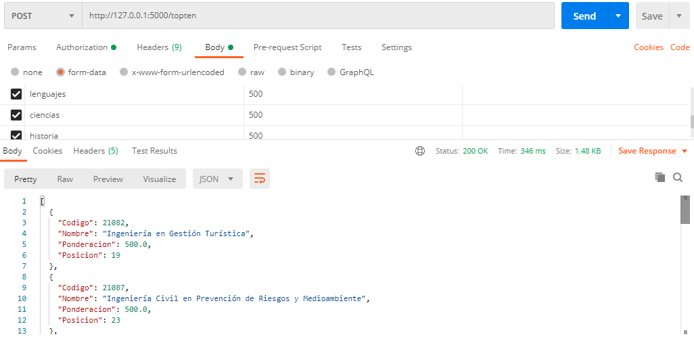

# Api-REST

_API de tipo REST para el ramo de Computacion Paralela y Distribuida de la UTEM (Trabajo 2); El servicio consta de 4 servicios:_

* TOPTEN: Servicio El cual recibe un grupo de puntajes de un estudiante, y entrega una lista con las 10 carreras donde queda mejor posicionado.

* CARRER: Servicio el cual recibe un codigo numero, el cual debe coincidir con el codigo de alguna carrera; En caso de exito, entrega toda la informacion de esa carrera.

* CARRERS: Servicio el cual recibe 1 a N palabras, las cuales son revisadas si coinciden dentro de alguno de los nombres de las carreras; En caso de exito, entrega la informacion de todas las carreras coincidentes.

### Pre-requisitos 📋

_Para la instalacion y correcto funcionamiento, se requiere lo siguiente:_

* [Python](Version 3.8) - Lenguaje empleado

_Mediante instalacion por pip (o pip3, dependiendo el caso de ya poseer python en el equipo), las siguientes librerias:_
* [Flask](Version )(pip install flask)(https://pypi.org/project/spyne/2.13.2a0/) - Framework estructural del sistema
* [Flask-HTTPAuth](Version 3.0.3)(pip install flask-httpauth)(https://pypi.org/project/Flask-HTTPAuth/) - Implementacion y manejo de seguridad
* [Flask-CORS](Version 3.0.3)(pip install flask-cors)(https://pypi.org/project/Flask-Cors/) - Implementacion y manejo de seguridad


### Despliegue 📦

_Para poder desplegar y consumir este servicio, se deben seguir los siguientes pasos_

_1)se debe realizar la instalacion de python, en su version 3.8; para esto, se puede descargar desde la pagina oficial de python(https://www.python.org/downloads/). Una vez instalado, se puede corroborar la version mediante la consola de comandos mediante el siguiente comando _

```
python --version
```

_En el caso de ya contar con python ya en el equipo (ejemplo de esto, es que el comando anterior arroje una version distinta de python), probar con el siguiente_

```
python3 --version
```

_2)Ya con python instalado, se procede a instalar las librerias correspondiente mediante el pip (pip3 en caso de tener que usar python3 para la version solicitada)_

```
pip install flask
pip install flask-httpauth
pip install flask-cors
```

_3)Ya con todas las dependencias instaladas, en la locacion del archivo api.py, mediante consola de comandos, activar el programa python (python3 en caso expresado anteriormente en el punto 1)_

```
python api.py
```

_Una vez teniendo el servidor operativo, se puede ingresar mediante un buscador de internet (Firefox por ejemplo), o mediante un cliente (Postman), en el cual la URL base para el consumo de la api es:_

```
http://127.0.0.1:5000/
```

_Si se a efectuado todo corrctamente, se le solicitara un usuario y una clave, las cuales para pruebas y analisis vienen a ser_

```
Usuario: Tester
Clave: betaman

Usuario: API
Clave: RDR-331
```

_Si a realizdo todo correctamente, aparecera en pantalla el mensaje de "Hi |user|!, The API it's working"_

## Ejecutando las pruebas ⚙️

_Las pruebas realizadas fueron consultando el servicio mediante la herramienta Postman. Para el caso del servicio TOPTEN, se testeo realizando 4 acciones_
* Correcto consumo
#####

* Promedio entre matematicas y Lenguajes menor a 450


* Faltando parametros


* Parametros no numericos


_Como se puede apreciar, en todos los casos erroneos, se entrega la respectiva descripcion del error junto a su codigo de error; Para el caso de CARRER, las pruebas fueron las siguientes:_

* Correcto consumo
#

* Codigo no numerico


* Sin parametros


* Exceso de parametros de parametros


* Codigo no correspondiente a ninguna carrera


_Al igual que en caso anterior, se puede observar como en caso de error o mal consumo, se entrega la informacion correspondiente. Ya finalizando con servicio CARRERS, las pruebas fueron las siguientes:_

* Correcto consumo


* Ausencia de parametros


* Un parametro no coincidente


* Un parametro demasiado corto


* Multiples parametros cortos


* Multiples no coincidentes


## Notas adicionales 📖
* El sistema consta de 2 usuarios permitidos, los cuales a la hora de pasar el sistema a produccion, se recomiendan cambiar o eliminar y reemplazar por un manejo con BB.DD.
* Los elementos enviados y la forma de envio de estos debe respetar las caracteristicas expuestas en el archivo PDF nombrado "ProyectoRest", el cual se encuentra en la carpeta "Material de Apoyo", como los expuestos en las demas notas adicionales.
* En el caso del servicio CARRERS, las palabras recibidas deben tener un largo minimo de 4 caracteres

## Autores ✒️

* **Ricardo Aliste G.** - *Desarrollado/Documentación*
* **Daniel Cajas U.** - *Documentación*
* **Rodrigo Carmona R.** - *Documentación*


Plantilla utilizada para el readme creada por [Villanuevand](https://github.com/Villanuevand) 😊
